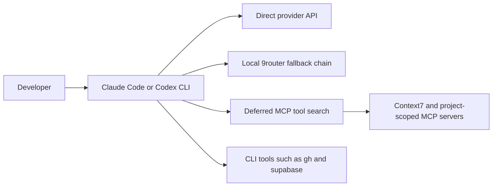

# ai-dev-setup

My Claude Code + Codex CLI setup on Windows, with a guide that explains *why* each piece exists and what I measured.
It keeps model routing, MCP context cost, and fallback behavior visible instead of hiding them behind a one-click installer.

[](https://github.com/reeve25/ai-dev-setup/actions/workflows/ci.yml)

**Start with [GUIDE.md](GUIDE.md).** It covers how MCP works under the hood (and what tool definitions cost per turn),
how both tools' memory files load, what I installed vs. rejected, daily workflows, and hands-on exercises.

## What's here
| Path | Goes to | Purpose |
|---|---|---|
| `claude/CLAUDE.md` | `~/.claude/CLAUDE.md` | global instructions for Claude Code |
| `codex/AGENTS.md` | `~/.codex/AGENTS.md` | the same rules for Codex |
| `claude/skills/*` | `~/.claude/skills/` and `~/.agents/skills/` | `/review-diff`, `/write-tests`, `/explain-codebase`, `/ship` (the same SKILL.md works in both tools) |
| `powershell/profile.ps1` | `$PROFILE` | `claude`/`codex` wrappers that route through a local model router, with a direct fallback |

## Architecture



The PowerShell wrappers choose direct or routed execution, set credentials only for the child process, and restore the previous environment afterward.

## Findings worth stealing
- **Claude Code turns off MCP tool search when `ANTHROPIC_BASE_URL` points at a proxy.** Setting `ENABLE_TOOL_SEARCH=true`
  cut my per-request prompt from ~42.5k to ~26.4k tokens (–38%), and deferred tool calls still worked through the proxy.
- **Prompt compression proxies can cost more than they save.** One I tried got 0 prompt-cache hits in 825 requests,
  because rewriting the prompt breaks caching, and cache reads are ~10× cheaper than fresh input.
- **Prefer a CLI over an MCP server** when one exists (`gh`, `supabase`): the model runs it through the shell at zero standing context cost.

## Measured output

| Measurement | Before | After | Change |
|---|---:|---:|---:|
| Per-request prompt with the custom base URL | ~42.5k tokens | ~26.4k tokens | -38% |

The before/after values came from Claude Code's `/context` report with the same setup, first without and then with `ENABLE_TOOL_SEARCH=true`.

## Design decisions

- Keep a direct-provider command beside the router path so a local routing failure does not block work.
- Defer MCP schemas because measured context cost mattered more than keeping every tool loaded on every turn.
- Prefer existing CLIs when they cover the same capability without permanent tool-definition overhead.
- Scope router environment variables to one process and restore the caller's environment in `finally`.

## Install (PowerShell)
```powershell
Copy-Item claude\CLAUDE.md $HOME\.claude\CLAUDE.md; Copy-Item codex\AGENTS.md $HOME\.codex\AGENTS.md
Copy-Item -Recurse claude\skills\* $HOME\.claude\skills\
New-Item -ItemType Directory -Force $HOME\.agents\skills | Out-Null; Copy-Item -Recurse claude\skills\* $HOME\.agents\skills\
```
Edit the "Machine" section of CLAUDE.md for your own paths first. The profile expects a router API key in the
user env var `NINE_ROUTER_API_KEY`; no secrets are stored in this repo.

To disable AI attribution trailers in Claude Code, add `"attribution": {"commit": "", "pr": ""}` to `~/.claude/settings.json`.

## What I'd do next

- Add Pester tests for environment restoration and direct fallback behavior.
- Re-run the token and cache measurements on a schedule so the guide does not freeze one client version in time.
- Add Linux and macOS setup examples after testing them on those platforms.

MIT licensed.
